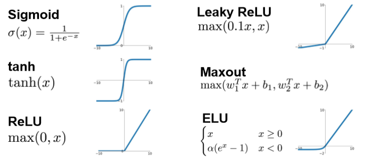
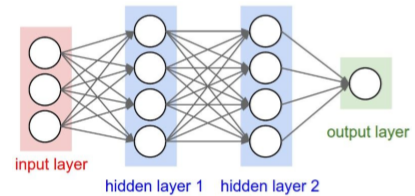
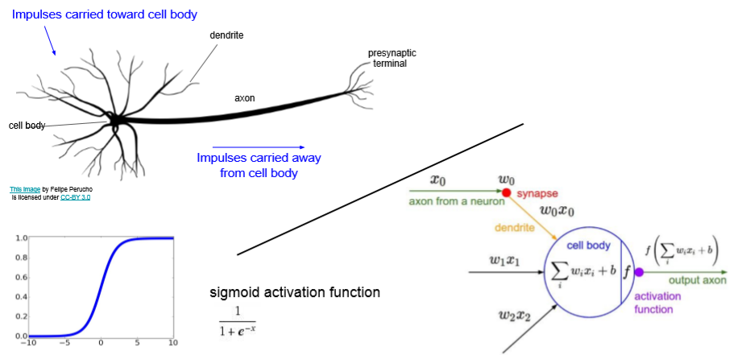
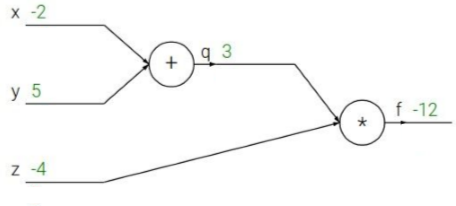
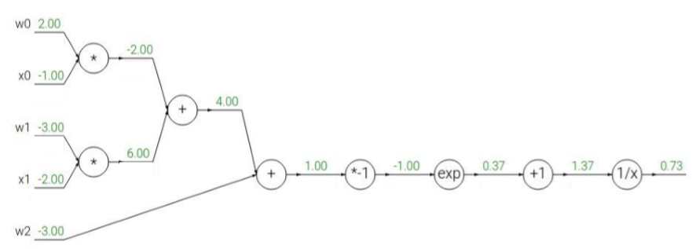
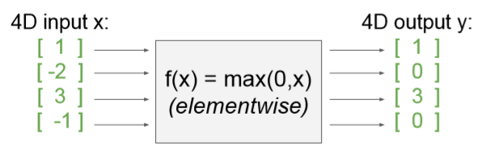

- # 反向传播笔记

  内容列表：

  - [简介]()
  - [简单的Neural Natworks]()
    - [常用的激活函数]()
    - [对结构的表述]()
    - [生物学类比]()
  - [反向传播算法计算梯度]()
    - [简单的例子]()
    - [模块化]()
    - [直观理解]()
    - [高维扩展]()
  - [小结]()


## 简介

**目标**：本节将帮助读者对**神经网络**形成直观而专业的理解，首先了解神经网络的一般架构，之后介绍其中重要的一环——利用**反向传播**计算梯度。反向传播是利用**链式法则**递归计算表达式的梯度的方法。理解反向传播过程及其精妙之处，对于理解、实现、设计和调试神经网络非常**关键**。

**问题陈述**：这节的核心问题是：给定函数![[公式]](https://www.zhihu.com/equation?tex=f%28x%29) ，其中![[公式]](https://www.zhihu.com/equation?tex=x)是输入数据的向量，需要计算函数![[公式]](https://www.zhihu.com/equation?tex=f)关于![[公式]](https://www.zhihu.com/equation?tex=x)的梯度，也就是![[公式]](https://www.zhihu.com/equation?tex=%5Cnabla+f%28x%29)。

**目标**：之所以关注上述问题，是因为在神经网络中![[公式]](https://www.zhihu.com/equation?tex=f)对应的是损失函数（![[公式]](https://www.zhihu.com/equation?tex=L)），输入![[公式]](https://www.zhihu.com/equation?tex=x)里面包含训练数据和神经网络的权重。如果用随机探测，不仅不准确而且时间过长（但是通常可以在第一步用随即探测检查反向传播的正确性）。

举个例子，损失函数可以是SVM的损失函数，输入则包含了训练数据![[公式]](https://www.zhihu.com/equation?tex=%28x_i%2Cy_i%29%2Ci%3D1...N)、权重![[公式]](https://www.zhihu.com/equation?tex=W)和偏差![[公式]](https://www.zhihu.com/equation?tex=b)。注意训练集是给定的（在机器学习中通常都是这样），而权重是可以控制的变量。因此，即使能用反向传播计算输入数据![[公式]](https://www.zhihu.com/equation?tex=x_i) 上的梯度，但在实践为了进行参数更新，通常也只计算参数（比如![[公式]](https://www.zhihu.com/equation?tex=W%2Cb)）的梯度。然而![[公式]](https://www.zhihu.com/equation?tex=x_i%0A) 的梯度有时仍然是有用的：比如将神经网络所做的事情可视化便于直观理解的时候，就能用上。


## 简单的Neural Networks

**线性**方程：$f=Wx$

**两层**的神经网络：$f=W_2max(0,W_1x),x\in R^D,W_! \in R^{H \times D},W_2 \in R^{C \times H}$


可以理解为10类又细分为100类，从而更好地处理每一类中图片不同情况的问题。$W_1$对图片处理，$W_2$对h的分类进行加权整合


**常用的激活函数**

在神经元的计算模型中，沿着轴突传播的信号（比如![[公式]](https://www.zhihu.com/equation?tex=x_0)）将基于突触的突触强度（比如![[公式]](https://www.zhihu.com/equation?tex=w_0)），与其他神经元的树突进行乘法交互（比如![[公式]](https://www.zhihu.com/equation?tex=w_0x_0)）。其观点是，突触的强度（也就是权重![[公式]](https://www.zhihu.com/equation?tex=w)），是可学习的且可以控制一个神经元对于另一个神经元的影响强度（还可以控制影响方向：使其兴奋（正权重）或使其抑制（负权重））。在基本模型中，树突将信号传递到细胞体，信号在细胞体中相加。如果最终之和高于某个阈值，那么神经元将会*激活*，向其轴突输出一个峰值信号。在计算模型中，我们假设峰值信号的准确时间点不重要，是激活信号的频率在交流信息。基于这个*速率编码*的观点，将神经元的激活率建模为**激活函数（****activation function****）![[公式]](https://www.zhihu.com/equation?tex=f)**，它表达了轴突上激活信号的频率。由于历史原因，激活函数常常选择使用**sigmoid函数![[公式]](https://www.zhihu.com/equation?tex=%5Csigma)**，该函数输入实数值（求和后的信号强度），然后将输入值压缩到0-1之间。在本节后面部分会看到这些激活函数的各种细节。



每个激活函数（或非线性函数）的输入都是一个数字，然后对其进行某种固定的数学操作。下面是在实践中可能遇到的几种激活函数：


左边是Sigmoid非线性函数，将实数压缩到[0,1]之间。右边是tanh函数，将实数压缩到[-1,1]。


**Sigmoid。**sigmoid非线性函数的数学公式是![[公式]](https://www.zhihu.com/equation?tex=%5Cdisplaystyle%5Csigma%28x%29%3D1%2F%281%2Be%5E%7B-x%7D%29)，函数图像如上图的左边所示。在前一节中已经提到过，它输入实数值并将其“挤压”到0到1范围内。更具体地说，很大的负数变成0，很大的正数变成1。在历史上，sigmoid函数非常常用，这是因为它对于神经元的激活频率有良好的解释：从完全不激活（0）到在求和后的最大频率处的完全饱和（**saturated**）的激活（1）。然而现在sigmoid函数已经不太受欢迎，实际很少使用了，这是因为它有两个主要缺点：


- *Sigmoid函数饱和使梯度消失*。sigmoid神经元有一个不好的特性，就是当神经元的激活在接近0或1处时会饱和：在这些区域，梯度几乎为0。回忆一下，在反向传播的时候，这个（局部）梯度将会与整个损失函数关于该门单元输出的梯度相乘。因此，如果局部梯度非常小，那么相乘的结果也会接近零，这会有效地“杀死”梯度，几乎就有没有信号通过神经元传到权重再到数据了。还有，为了防止饱和，必须对于权重矩阵初始化特别留意。比如，如果初始化权重过大，那么大多数神经元将会饱和，导致网络就几乎不学习了。
- *Sigmoid函数的输出不是零中心的*。这个性质并不是我们想要的，因为在神经网络后面层中的神经元得到的数据将不是零中心的。这一情况将影响梯度下降的运作，因为如果输入神经元的数据总是正数（比如在![[公式]](https://www.zhihu.com/equation?tex=f%3Dw%5ETx%2Bb)中每个元素都![[公式]](https://www.zhihu.com/equation?tex=x%3E0)），那么关于![[公式]](https://www.zhihu.com/equation?tex=w)的梯度在反向传播的过程中，将会要么全部是正数，要么全部是负数（具体依整个表达式![[公式]](https://www.zhihu.com/equation?tex=f)而定）。这将会导致梯度下降权重更新时出现z字型的下降。然而，可以看到整个批量的数据的梯度被加起来后，对于权重的最终更新将会有不同的正负，这样就从一定程度上减轻了这个问题。因此，该问题相对于上面的神经元饱和问题来说只是个小麻烦，没有那么严重。

**Tanh。**tanh非线性函数图像如上图右边所示。它将实数值压缩到[-1,1]之间。和sigmoid神经元一样，它也存在饱和问题，但是和sigmoid神经元不同的是，它的输出是零中心的。因此，在实际操作中，*tanh非线性函数比sigmoid非线性函数更受欢迎*。注意tanh神经元是一个简单放大的sigmoid神经元，具体说来就是：![[公式]](https://www.zhihu.com/equation?tex=tanh%28x%29%3D2%5Csigma%282x%29-1)。

————————————————————————————————————————


左边是ReLU（校正线性单元：Rectified Linear Unit）激活函数，当![[公式]](https://www.zhihu.com/equation?tex=x%3D0)时函数值为0。当![[公式]](https://www.zhihu.com/equation?tex=x%3E0)函数的斜率为1。右边是从 [Krizhevsky](https://link.zhihu.com/?target=http%3A//www.cs.toronto.edu/~fritz/absps/imagenet.pdf)等的论文中截取的图表，指明使用ReLU比使用tanh的收敛快6倍。


————————————————————————————————————————

**ReLU。**在近些年ReLU变得非常流行。它的函数公式是![[公式]](https://www.zhihu.com/equation?tex=f%28x%29%3Dmax%280%2Cx%29)。换句话说，这个激活函数就是一个关于0的阈值（如上图左侧）。使用ReLU有以下一些优缺点：

- 优点：相较于sigmoid和tanh函数，ReLU对于随机梯度下降的收敛有巨大的加速作用（ [Krizhevsky ](https://link.zhihu.com/?target=http%3A//www.cs.toronto.edu/~fritz/absps/imagenet.pdf)等的论文指出有6倍之多）。据称这是由它的线性，非饱和的公式导致的。
- 优点：sigmoid和tanh神经元含有指数运算等耗费计算资源的操作，而ReLU可以简单地通过对一个矩阵进行阈值计算得到。
- 缺点：在训练的时候，ReLU单元比较脆弱并且可能“死掉”。举例来说，当一个很大的梯度流过ReLU的神经元的时候，可能会导致梯度更新到一种特别的状态，在这种状态下神经元将无法被其他任何数据点再次激活。如果这种情况发生，那么从此所以流过这个神经元的梯度将都变成0。也就是说，这个ReLU单元在训练中将不可逆转的死亡，因为这导致了数据多样化的丢失。例如，如果学习率设置得太高，可能会发现网络中40%的神经元都会死掉（在整个训练集中这些神经元都不会被激活）。通过合理设置学习率，这种情况的发生概率会降低。

**Leaky ReLU。**Leaky ReLU是为解决“ReLU死亡”问题的尝试。ReLU中当x<0时，函数值为0。而Leaky ReLU则是给出一个很小的负数梯度值，比如0.01。所以其函数公式为![[公式]](https://www.zhihu.com/equation?tex=f%28x%29%3D1%28x%3C0%29%28%5Calpha+x%29%2B1%28x%3E%3D0%29%28x%29)其中![[公式]](https://www.zhihu.com/equation?tex=%5Calpha)是一个小的常量。有些研究者的论文指出这个激活函数表现很不错，但是其效果并不是很稳定。Kaiming He等人在2015年发布的论文[Delving Deep into Rectifiers](https://link.zhihu.com/?target=http%3A//arxiv.org/abs/1502.01852)中介绍了一种新方法PReLU，把负区间上的斜率当做每个神经元中的一个参数。然而该激活函数在在不同任务中均有益处的一致性并没有特别清晰。


**Maxout。**一些其他类型的单元被提了出来，它们对于权重和数据的内积结果不再使用![[公式]](https://www.zhihu.com/equation?tex=f%28w%5ETx%2Bb%29)函数形式。一个相关的流行选择是Maxout（最近由[Goodfellow](https://link.zhihu.com/?target=http%3A//www-etud.iro.umontreal.ca/~goodfeli/maxout.html)等发布）神经元。Maxout是对ReLU和leaky ReLU的一般化归纳，它的函数是：![[公式]](https://www.zhihu.com/equation?tex=max%28w%5ET_1x%2Bb_1%2Cw%5ET_2x%2Bb_2%29)。ReLU和Leaky ReLU都是这个公式的特殊情况（比如ReLU就是当![[公式]](https://www.zhihu.com/equation?tex=w_1%2Cb_1%3D0)的时候）。这样Maxout神经元就拥有ReLU单元的所有优点（线性操作和不饱和），而没有它的缺点（死亡的ReLU单元）。然而和ReLU对比，它每个神经元的参数数量增加了一倍，这就导致整体参数的数量激增。

以上就是一些常用的神经元及其激活函数。最后需要注意一点：在同一个网络中混合使用不同类型的神经元是非常少见的，虽然没有什么根本性问题来禁止这样做。

**一句话**：“*那么该用那种呢？*”用ReLU非线性函数。注意设置好学习率，或许可以监控你的网络中死亡的神经元占的比例。如果单元死亡问题困扰你，就试试Leaky ReLU或者Maxout，不要再用sigmoid了。也可以试试tanh，但是其效果应该不如ReLU或者Maxout。


**对于Neural Networks结构的表述**



```python
# forward pass of a 3-layer neral network:
f = lambda x:1.0/(1.0 + np.exp(-x)) # activation function (use sigmoid)
x = np.random.randn(3,1) # radom input vector of three numbers (3*1)
h1 = f(np.dot(W1, x) + b1) # calculate first hidden layer activations (4*1)
h2 = f(np.dot(W2, h1) + b2) # calculate second hidden layer activations (4*1)
out = np.dot(W3, h2) + b3 # output neuron (1*1)
```

我们通常称为三层神经网络（3-layer Neural Net），也称为 2-hidden-layer Neural Net


**生物学类比**



至于“神经网络”，因为它与神经元有着极大的相似之处，树突相当于输入的数据，细胞体对输入数据的处理相当于f，轴突向下的传导相当于output；激活函数和神经元的发放率也有着相似的模式


## 反向传播算法计算梯度

#### 简单的例子

首先要知道链式法则，反向传播的过程像是利用链式法则逐层求导的过程



$f(x,y,z)=(x+y)z,\quad let x=-2,y=-5,z=-4$

$q=x+y,\frac{\delta q}{\delta x}=1,\frac{\delta q}{\delta y}=1 \quad f=qz,\frac{\delta f}{\delta q}=z,\frac{\delta f}{\delta z}=q$

$\frac{\delta f}{\delta x}=\frac{\delta f}{\delta q} \frac{\delta q}{\delta x}=z=-4 \quad \frac{\delta f}{\delta y}=\frac{\delta f}{\delta q} \frac{\delta q}{\delta y}=z=-4$

$\frac{\delta f}{\delta z}=q=x+y=3$

其实我们并不关心中间节点q的梯度，它对整个计算并没有意义，而是我们利用链式法则的工具

取最大值操作也是常常使用的：
![[公式]](https://www.zhihu.com/equation?tex=%5Cdisplaystyle+f%28x%2Cy%29%3Dmax%28x%2Cy%29+%5Cto+%5Cfrac+%7Bdf%7D%7Bdx%7D%3D1+%28x%3E%3Dy%29+%5Cquad%5Cfrac+%7Bdf%7D%7Bdy%7D%3D1+%28y%3E%3Dx%29)

上式是说，如果该变量比另一个变量大，那么梯度是1，反之为0。例如，若![[公式]](https://www.zhihu.com/equation?tex=x%3D4%2Cy%3D2)，那么max是4，所以函数对于![[公式]](https://www.zhihu.com/equation?tex=y)就不敏感。也就是说，在![[公式]](https://www.zhihu.com/equation?tex=y)上增加![[公式]](https://www.zhihu.com/equation?tex=h)，函数还是输出为4，所以梯度是0：因为对于函数输出是没有效果的。当然，如果给![[公式]](https://www.zhihu.com/equation?tex=y)增加一个很大的量，比如大于2，那么函数![[公式]](https://www.zhihu.com/equation?tex=f)的值就变化了，但是导数并没有指明输入量有巨大变化情况对于函数的效果，他们只适用于输入量变化极小时的情况，因为定义已经指明：![[公式]](https://www.zhihu.com/equation?tex=lim_%7Bh%5Cto+0%7D)。


#### 模块化：以sigmoid为例

$f(w,x)=\frac{1}{1+e^{-(w_0x_0+w_1x_1+w_2)}}$



$f(x)=1/x \rightarrow \frac{df}{dx}=-1/x^2 \quad f(x)=x+1 \rightarrow \frac{df}{dx}=1$

$f(x)=e^x \rightarrow \frac{df}{dx}=e^x \quad f(x)=wx \rightarrow \frac{df}{dx}=w$

代入计算，可得所有边上的梯度值，并且发现其中的sigmoid可以将$\sigma(x)=\frac{1}{1+e^{-x}}$模块化为一个“黑箱子”，$\frac{d\sigma(x)}{dx}=(1-\sigma (x))\sigma (x)$


通常，我们也把一个节点叫做gate，常用的有+、*、max、copy

因为是从结果向前计算，所以正向计算输出，反向传播求梯度


该神经元反向传播的代码实现如下：

```python
w = [2,-3,-3] # 假设一些随机数据和权重
x = [-1, -2]

# 前向传播
dot = w[0]*x[0] + w[1]*x[1] + w[2]
f = 1.0 / (1 + math.exp(-dot)) # sigmoid函数

# 对神经元反向传播
ddot = (1 - f) * f # 点积变量的梯度, 使用sigmoid函数求导
dx = [w[0] * ddot, w[1] * ddot] # 回传到x
dw = [x[0] * ddot, x[1] * ddot, 1.0 * ddot] # 回传到w
# 完成！得到输入的梯度
```


**实现提示：分段反向传播**。

上面的代码展示了在实际操作中，为了使反向传播过程更加简洁，把向前传播分成不同的阶段将是很有帮助的。比如我们创建了一个中间变量**dot**，它装着**w**和**x**的点乘结果。在反向传播的时，就可以（反向地）计算出装着**w**和**x**等的梯度的对应的变量（比如**ddot**，**dx**和**dw**）。


#### 反向传播的直观理解

反向传播是一个优美的局部过程。在整个计算线路图中，每个门单元都会得到一些输入并立即计算两个东西：1. 这个门的输出值，和2.其输出值关于输入值的局部梯度。门单元完成这两件事是完全独立的，它不需要知道计算线路中的其他细节。然而，一旦前向传播完毕，在反向传播的过程中，门单元门将最终获得整个网络的最终输出值在自己的输出值上的梯度。链式法则指出，门单元应该将回传的梯度乘以它对其的输入的局部梯度，从而得到整个网络的输出对该门单元的每个输入值的梯度。

> 这里对于每个输入的乘法操作是基于链式法则的。该操作让一个相对独立的门单元变成复杂计算线路中不可或缺的一部分，这个复杂计算线路可以是神经网络等。

下面通过例子来对这一过程进行理解。加法门收到了输入[-2, 5]，计算输出是3。既然这个门是加法操作，那么对于两个输入的局部梯度都是+1。网络的其余部分计算出最终值为-12。在反向传播时将递归地使用链式法则，算到加法门（是乘法门的输入）的时候，知道加法门的输出的梯度是-4。如果网络如果想要输出值更高，那么可以认为它会想要加法门的输出更小一点（因为负号），而且还有一个4的倍数。继续递归并对梯度使用链式法则，加法门拿到梯度，然后把这个梯度分别乘到每个输入值的局部梯度（就是让-4乘以**x**和**y**的局部梯度，x和y的局部梯度都是1，所以最终都是-4）。可以看到得到了想要的效果：如果**x，y减小**（它们的梯度为负），那么加法门的输出值减小，这会让乘法门的输出值增大。

因此，反向传播可以看做是门单元之间在通过梯度信号相互通信，只要让它们的输入沿着梯度方向变化，无论它们自己的输出值在何种程度上升或降低，都是为了让整个网络的输出值更高。


#### 高维扩展



对于高维（m）的输入和高维（n）的输出，梯度是雅可比矩阵（m*n）

在上图的例子中，由于$y_i$只与$x_i$有关，所以Jacobian矩阵是一个对角矩阵，从而我们不需要将m*n的空间来储存，可以只存对角矩阵的主对角线，从而节省空间


#### 注意

**对前向传播变量进行缓存**：在计算反向传播时，前向传播过程中得到的一些中间变量非常有用。在实际操作中，最好代码实现对于这些中间变量的缓存，这样在反向传播的时候也能用上它们。如果这样做过于困难，也可以（但是浪费计算资源）重新计算它们。

**在不同分支的梯度要相加**：如果变量x，y在前向传播的表达式中出现多次，那么进行反向传播的时候就要非常小心，使用**+=**而不是**=**来累计这些变量的梯度（不然就会造成覆写）。这是遵循了在微积分中的*多元链式法则*，该法则指出如果变量在线路中分支走向不同的部分，那么梯度在回传的时候，就应该进行累加。


## 小结

- 直观地认识了**神经网络**的基本架构和函数构成，就是通过一层一层的计算处理数据，类似于将原始的图片分成不同的小类，再对小类加权形成大类，相当于对一个类形成了不同的模板
- 对**梯度**的含义有了直观理解，知道了梯度是如何在网络中**反向传播**的，知道了它们是如何与网络的不同部分通信并控制其升高或者降低，并使得最终输出值更高的。
- 讨论了**模块化**在反向传播的实现中的重要性。应该将函数分成不同的模块，这样计算局部梯度相对容易，然后基于链式法则将其“链”起来。重要的是，不需要把这些表达式写在纸上然后演算它的完整求导公式，因为实际上并不需要关于输入变量的梯度的数学公式。只需要将表达式分成不同的可以求导的模块（模块可以是矩阵向量的乘法操作，或者取最大值操作，或者加法操作等），然后在反向传播中一步一步地计算梯度。

在下节课中，将会开始定义神经网络，而反向传播使我们能高效计算神经网络各个节点关于损失函数的梯度。换句话说，我们现在已经准备好训练神经网络了，这就是本课程最困难的部分了，ConvNets相比只是向前走了一小步。
