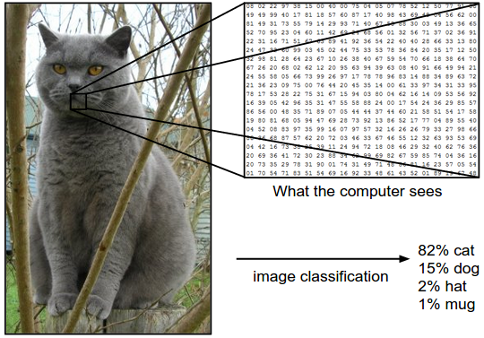
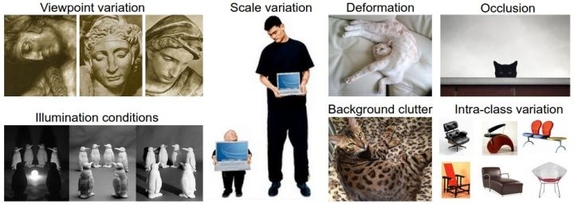
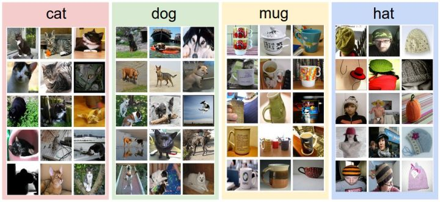
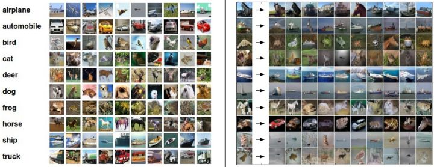

# 图像分类笔记1

## Table of contents

* [图像分类笔记1](#图像分类笔记1)

  * [01.图像分类、数据驱动方法和流程](#图像分类、数据驱动方法和流程)
  * [02.最近邻分类器](#最近邻分类器)
  
    * [KNN](#KNN)
  * [03. 验证集、交叉验证集和超参数调参](#验证集、交叉验证集和超参数调参)
  * [04. 小结](#小结)
  * [05. 应用kNN实践](#应用kNN实践)


## 图像分类

**目标**：这一节我们将介绍图像分类问题。所谓图像分类问题，就是已有固定的分类标签集合，然后对于输入的图像，从分类标签集合中找出一个分类标签，最后把分类标签分配给该输入图像。虽然看起来挺简单的，但这可是计算机视觉领域的核心问题之一，并且有着各种各样的实际应用。在后面的课程中，我们可以看到计算机视觉领域中很多看似不同的问题（比如物体检测和分割），都可以被归结为图像分类问题。

**例子**：以下图为例，图像分类模型读取该图片，并生成该图片属于集合 {cat, dog, hat, mug}中各个标签的概率。需要注意的是，对于计算机来说，图像是一个由数字组成的巨大的3维数组。在这个例子中，猫的图像大小是宽248像素，高400像素，有3个颜色通道，分别是红、绿和蓝（简称RGB）。如此，该图像就包含了248X400X3=297600个数字，每个数字都是在范围0-255之间的整型，其中0表示全黑，255表示全白。我们的任务就是把这些上百万的数字变成一个简单的标签，比如“猫”。

——————————————————————————————————————————————————



图像分类的任务，就是对于一个给定的图像，预测它属于的那个分类标签（或者给出属于一系列不同标签的可能性）。图像是3维数组，数组元素是取值范围从0到255的整数。数组的尺寸是宽度x高度x3，其中这个3代表的是红、绿和蓝3个颜色通道。

——————————————————————————————————————————————————

**困难和挑战**：对于人来说，识别出一个像“猫”一样视觉概念是简单至极的，然而从计算机视觉算法的角度来看就值得深思了。我们在下面列举了计算机视觉算法在图像识别方面遇到的一些困难，要记住图像是以3维数组来表示的，数组中的元素是亮度值。

- **视角变化（\**Viewpoint variation\**）**：同一个物体，摄像机可以从多个角度来展现。
- **大小变化（\**Scale variation\**）**：物体可视的大小通常是会变化的（不仅是在图片中，在真实世界中大小也是变化的）。
- **形变（\**Deformation\**）**：很多东西的形状并非一成不变，会有很大变化。
- **遮挡（\**Occlusion\**）**：目标物体可能被挡住。有时候只有物体的一小部分（可以小到几个像素）是可见的。
- **光照条件（\**Illumination conditions\**）**：在像素层面上，光照的影响非常大。
- **背景干扰（\**Background clutter\**）**：物体可能混入背景之中，使之难以被辨认。
- **类内差异（\**Intra-class variation\**）**：一类物体的个体之间的外形差异很大，比如椅子。这一类物体有许多不同的对象，每个都有自己的外形。

面对以上所有变化及其组合，好的图像分类模型能够在维持分类结论稳定的同时，保持对类间差异足够敏感。

——————————————————————————————————————————————————



——————————————————————————————————————————————————

**数据驱动方法**：如何写一个图像分类的算法呢？这和写个排序算法可是大不一样。怎么写一个从图像中认出猫的算法？搞不清楚。因此，与其在代码中直接写明各类物体到底看起来是什么样的，倒不如说我们采取的方法和教小孩儿看图识物类似：给计算机很多数据，然后实现学习算法，让计算机学习到每个类的外形。这种方法，就是*数据驱动方法*。既然该方法的第一步就是收集已经做好分类标注的图片来作为训练集，那么下面就看看数据库到底长什么样：

——————————————————————————————————————————————————



一个有4个视觉分类的训练集。在实际中，我们可能有上千的分类，每个分类都有成千上万的图像。

——————————————————————————————————————————————————

**图像分类流程**。在课程视频中已经学习过，**图像分类**就是输入一个元素为像素值的数组，然后给它分配一个分类标签。完整流程如下：

- **输入**：输入是包含N个图像的集合，每个图像的标签是K种分类标签中的一种。这个集合称为*训练集。*
- **学习**：这一步的任务是使用训练集来学习每个类到底长什么样。一般该步骤叫做*训练分类器*或者*学习一个模型*。
- **评价**：让分类器来预测它未曾见过的图像的分类标签，并以此来评价分类器的质量。我们会把分类器预测的标签和图像真正的分类标签对比。毫无疑问，分类器预测的分类标签和图像真正的分类标签如果一致，那就是好事，这样的情况越多越好。

## Nearest Neighbor分类器

作为课程介绍的第一个方法，我们来实现一个**Nearest Neighbor分类器**。虽然这个分类器和卷积神经网络没有任何关系，实际中也极少使用，但通过实现它，可以让读者对于解决图像分类问题的方法有个基本的认识。

**图像分类数据集：CIFAR-10。**一个非常流行的图像分类数据集是[CIFAR-10]。这个数据集包含了60000张32X32的小图像。每张图像都有10种分类标签中的一种。这60000张图像被分为包含50000张图像的训练集和包含10000张图像的测试集。在下图中你可以看见10个类的10张随机图片。

——————————————————————————————————————————————————



**左边**：从[CIFAR-10]数据库来的样本图像。**右边**：第一列是测试图像，然后第一列的每个测试图像右边是使用Nearest Neighbor算法，根据像素差异，从训练集中选出的10张最类似的图片。

——————————————————————————————————————————————————

假设现在我们有CIFAR-10的50000张图片（每种分类5000张）作为训练集，我们希望将余下的10000作为测试集并给他们打上标签。Nearest Neighbor算法将会拿着测试图片和训练集中每一张图片去比较，然后将它认为最相似的那个训练集图片的标签赋给这张测试图片。上面右边的图片就展示了这样的结果。请注意上面10个分类中，只有3个是准确的。比如第8行中，马头被分类为一个红色的跑车，原因在于红色跑车的黑色背景非常强烈，所以这匹马就被错误分类为跑车了。

那么具体如何比较两张图片呢？在本例中，就是比较32x32x3的像素块。最简单的方法就是逐个像素比较，最后将差异值全部加起来。换句话说，就是将两张图片先转化为两个向量$I_1$和$I_2$，然后计算他们的**L1距离：**

$$d_1(I_1,I_2)=\Sigma_p|I_1^p-I_2^p|$$

这里的求和是针对所有的像素。下面是整个比较流程的图例：

——————————————————————————————————————————————————


以图片中的一个颜色通道为例来进行说明。两张图片使用L1距离来进行比较。逐个像素求差值，然后将所有差值加起来得到一个数值。如果两张图片一模一样，那么L1距离为0，但是如果两张图片很是不同，那L1值将会非常大。

——————————————————————————————————————————————————

下面，让我们看看如何用代码来实现这个分类器。首先，我们将CIFAR-10的数据加载到内存中，并分成4个数组：训练数据和标签，测试数据和标签。在下面的代码中，**Xtr**（大小是50000x32x32x3）存有训练集中所有的图像，**Ytr**是对应的长度为50000的1维数组，存有图像对应的分类标签（从0到9）：

```python
Xtr, Ytr, Xte, Yte = load_CIFAR10('data/cifar10/') # a magic function we provide
# flatten out all images to be one-dimensional
Xtr_rows = Xtr.reshape(Xtr.shape[0], 32 * 32 * 3) # Xtr_rows becomes 50000 x 3072
Xte_rows = Xte.reshape(Xte.shape[0], 32 * 32 * 3) # Xte_rows becomes 10000 x 3072
```

现在我们得到所有的图像数据，并且把他们拉长成为行向量了。接下来展示如何训练并评价一个分类器：

```python
nn = NearestNeighbor() # create a Nearest Neighbor classifier class
nn.train(Xtr_rows, Ytr) # train the classifier on the training images and labels
Yte_predict = nn.predict(Xte_rows) # predict labels on the test images
# and now print the classification accuracy, which is the average number
# of examples that are correctly predicted (i.e. label matches)
print 'accuracy: %f' % ( np.mean(Yte_predict == Yte) )
```

作为评价标准，我们常常使用**准确率**，它描述了我们预测正确的得分。请注意以后我们实现的所有分类器都需要有这个API：**train(X, y)**函数。该函数使用训练集的数据和标签来进行训练。从其内部来看，类应该实现一些关于标签和标签如何被预测的模型。这里还有个**predict(X)**函数，它的作用是预测输入的新数据的分类标签。现在还没介绍分类器的实现，下面就是使用L1距离的Nearest Neighbor分类器的实现套路：

```python
import numpy as np

class NearestNeighbor(object):
  def __init__(self):
    pass

  def train(self, X, y):
    """ X is N x D where each row is an example. Y is 1-dimension of size N """
    # the nearest neighbor classifier simply remembers all the training data
    self.Xtr = X
    self.ytr = y

  def predict(self, X):
    """ X is N x D where each row is an example we wish to predict label for """
    num_test = X.shape[0]
    # lets make sure that the output type matches the input type
    Ypred = np.zeros(num_test, dtype = self.ytr.dtype)

    # loop over all test rows
    for i in xrange(num_test):
      # find the nearest training image to the i'th test image
      # using the L1 distance (sum of absolute value differences)
      distances = np.sum(np.abs(self.Xtr - X[i,:]), axis = 1)
      min_index = np.argmin(distances) # get the index with smallest distance
      Ypred[i] = self.ytr[min_index] # predict the label of the nearest example

    return Ypred
```

如果用这段代码跑CIFAR-10，你会发现准确率能达到**38.6%**。这比随机猜测的10%要好，但是比人类识别的水平（[据研究推测是94%](https://link.zhihu.com/?target=http%3A//karpathy.github.io/2011/04/27/manually-classifying-cifar10/)）和卷积神经网络能达到的95%还是差多了。基于CIFAR-10数据的[Kaggle算法竞赛排行榜]。

**距离选择**：计算向量间的距离有很多种方法，另一个常用的方法是**L2距离**，从几何学的角度，可以理解为它在计算两个向量间的欧式距离。L2距离的公式如下：

$$d_2(I_1,I_2)=\sqrt{\Sigma_p(I_1^p-I_2^p)^2}$$

换句话说，我们依旧是在计算像素间的差值，只是先求其平方，然后把这些平方全部加起来，最后对这个和开方。在Numpy中，我们只需要替换上面代码中的1行代码就行：

```python
distances = np.sqrt(np.sum(np.square(self.Xtr - X[i,:]), axis = 1))
```

注意在这里使用了**np.sqrt**，但是在实际中可能不用。因为求平方根函数是一个*单调函数*，它对不同距离的绝对值求平方根虽然改变了数值大小，但依然保持了不同距离大小的顺序。所以用不用它，都能够对像素差异的大小进行正确比较。如果你在CIFAR-10上面跑这个模型，正确率是**35.4%**，比刚才低了一点。

**L1和L2比较**。比较这两个度量方式是挺有意思的。在面对两个向量之间的差异时，L2比L1更加不能容忍这些差异。也就是说，相对于1个巨大的差异，L2距离更倾向于接受多个中等程度的差异。L1和L2都是在[p-norm](https://link.zhihu.com/?target=http%3A//planetmath.org/vectorpnorm)常用的特殊形式。

## k-Nearest Neighbor分类器

你可能注意到了，为什么只用最相似的1张图片的标签来作为测试图像的标签呢？这不是很奇怪吗！是的，使用**k-Nearest Neighbor分类器**就能做得更好。它的思想很简单：与其只找最相近的那1个图片的标签，我们找最相似的k个图片的标签，然后让他们针对测试图片进行投票，最后把票数最高的标签作为对测试图片的预测。所以当k=1的时候，k-Nearest Neighbor分类器就是Nearest Neighbor分类器。从直观感受上就可以看到，更高的k值可以让分类的效果更平滑，使得分类器对于异常值更有抵抗力。

——————————————————————————————————————————————————


上面示例展示了Nearest Neighbor分类器和5-Nearest Neighbor分类器的区别。例子使用了2维的点来表示，分成3类（红、蓝和绿）。不同颜色区域代表的是使用L2距离的分类器的**决策边界**。白色的区域是分类模糊的例子（即图像与两个以上的分类标签绑定）。需要注意的是，在NN分类器中，异常的数据点（比如：在蓝色区域中的绿点）制造出一个不正确预测的孤岛。5-NN分类器将这些不规则都平滑了，使得它针对测试数据的**泛化（generalization）**能力更好（例子中未展示）。注意，5-NN中也存在一些灰色区域，这些区域是因为近邻标签的最高票数相同导致的（比如：2个邻居是红色，2个邻居是蓝色，还有1个是绿色）。

——————————————————————————————————————————————————

在实际中，大多使用k-NN分类器。
